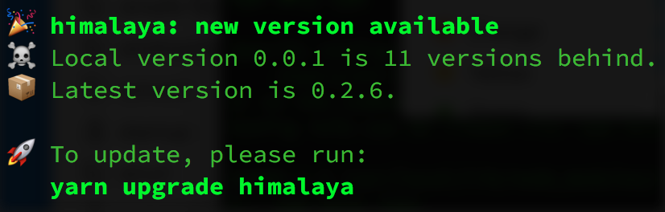

<h1 align="center">
	<br>
	<br>
	
	<br>
	<br>
	<br>
</h1>

> Notify when you release a new version

[](example.js)

```sh
npm install please-update
```

[](https://travis-ci.org/andrejewski/please-update)
[](https://coveralls.io/github/andrejewski/please-update?branch=master)

## Why even?
Cool CLI tools will notify users when a new version releases so they can update.
Please Update makes your CLI tool cool, fool.

Note: Programs that run longer than it takes for an HTTPS request can use this too.

## Usage

```js
import update from 'please-update'
import pkg from './package.json'

update({
  package: pkg.name,
  version: pkg.version
}).then(() => {
  /* prints:
🎉 {packageName}: new version available
☠️ Local is {newerVersions.length} releases behind.
📦 Latest version is {newestVersion}.

🚀 To upgrade, please run:
{npm|yarn} [--global|global] {update|upgrade} {packageName}
  */
})
```

#### Considerations
The [`is-ci`](https://github.com/watson/is-ci) library detects if a command runs on CI servers.
If so, no message prints.

The default message will contain [emoji](https://github.com/omnidan/node-emoji) when supported.

## Documentation
Here are all the supported options.

| Property | Type | Default | Description |
| -------- | ---- | ------- | ----------- |
| `package` | string | **required** | The package name
| `version` | string | **required** | The current, local package version
| `preferGlobal` | boolean | `false` | Whether to show the global install command
| `includeTaggedVersions` | boolean | `false` | Whether to count tagged versions (betas, alphas) as versions
| `persistCheck` | boolean | `true` | Delegate to Please Update the task of remembering the last check time for an update
| `checkInterval` | number | 24 hours | Number of milliseconds to wait before checking for an update again
| `lastCheck` | number | 0 | The last check time in milliseconds. Needed if `persistCheck` is false.
| `displayFn` | (info: object) -> void | *built-in* | Function passed all the data necessary to print an update warning.
| `preventUpdate` | boolean | `isCI` | Whether to never check or display a warning
| `silenceErrors` | boolean | `true` | Whether to ignore an error if the NPM registry is down

## Contributing
Contributions are incredibly welcome as long as they are standardly applicable and pass the tests (or break bad ones). Tests are in AVA.

```bash
# running tests
npm run test
```

Follow me on [Twitter](https://twitter.com/compooter) for updates or for the lolz and please check out my other [repositories](https://github.com/andrejewski) if I have earned it. I thank you for reading.
